

  

  
  
  
  

  I build client-ready mobile apps, web platforms, and backend systems for startups, founders, and companies that need polished software shipped fast. 
  My latest public portfolio is published through <a href="https://kodingklouds.com">KodingKlouds</a>, with current delivery centered on Flutter, React/Next.js, Node.js, Firebase, AI integrations, and launch-ready product builds.

  <strong>Open to freelance work, product builds, and long-term collaborations across the US, UK, AU, CA, EU, and Asia.</strong>

<table align="center">
  <tr>
    <td align="center" width="25%">
      <strong>200+</strong> 
      Projects delivered
    </td>
    <td align="center" width="25%">
      <strong>100+</strong> 
      Happy clients
    </td>
    <td align="center" width="25%">
      <strong>4.9/5</strong> 
      Public aggregate rating
    </td>
    <td align="center" width="25%">
      <strong>7-14 days</strong> 
      MVP-focused launch window
    </td>
  </tr>
</table>

## What I Build

<table>
  <tr>
    <td width="50%" valign="top">
      <strong>Flutter mobile apps</strong> 
      Cross-platform iOS and Android products with native-feel UX, realtime features, push notifications, subscriptions, and launch support.
    </td>
    <td width="50%" valign="top">
      <strong>React and Next.js web apps</strong> 
      Fast, conversion-focused websites, dashboards, booking systems, marketplaces, and admin panels with SEO and Core Web Vitals in mind.
    </td>
  </tr>
  <tr>
    <td width="50%" valign="top">
      <strong>Backend and API systems</strong> 
      Secure APIs, auth, analytics, logging, databases, cloud deployment, and scalable infrastructure that can support growth instead of blocking it.
    </td>
    <td width="50%" valign="top">
      <strong>AI integration</strong> 
      ChatGPT workflows, intelligent assistants, automation, predictive features, and product-ready AI functionality that fits the business use case.
    </td>
  </tr>
</table>

## Selected Work

<table>
  <tr>
    <td width="50%" valign="top">
      <a href="https://play.google.com/store/apps/details?id=com.hyperfocus.app">
        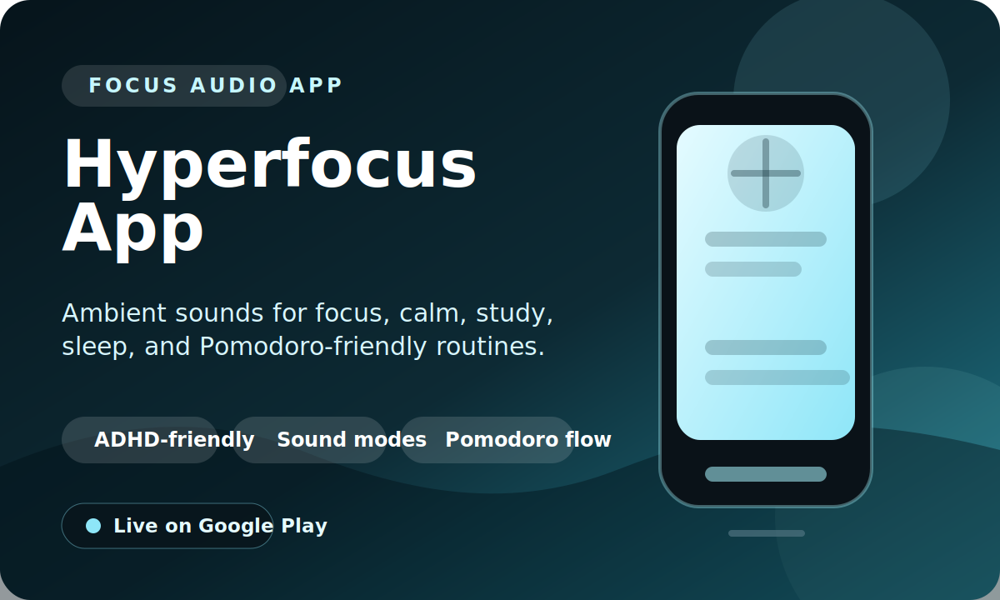
      </a>
      
FOCUS AUDIO APP

      <h3 align="center">Hyperfocus App</h3>
      

        Focus and calming audio product built for study, sleep, Pomodoro-style sessions, and low-friction daily concentration.
      

      
<code>ADHD-Friendly</code> <code>Sound Modes</code> <code>Pomodoro</code>

      
<strong>Launch:</strong> Live on Google Play

      

        <a href="https://play.google.com/store/apps/details?id=com.hyperfocus.app">Android</a>
      

    </td>
    <td width="50%" valign="top">
      <a href="https://play.google.com/store/apps/details?id=com.app.a2b">
        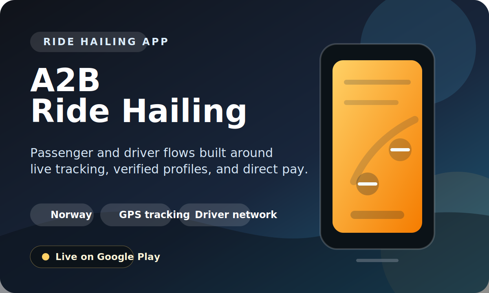
      </a>
      
RIDE HAILING APP

      <h3 align="center">A2B Ride Hailing</h3>
      

        Ride-matching app for passengers and drivers in Norway with real-time GPS tracking, verified profiles, and direct driver payments.
      

      
<code>Mobility</code> <code>GPS Tracking</code> <code>Driver Network</code>

      
<strong>Launch:</strong> Live on Google Play

      

        <a href="https://play.google.com/store/apps/details?id=com.app.a2b">Android</a>
      

    </td>
  </tr>
  <tr>
    <td width="50%" valign="top">
      <a href="https://play.google.com/store/apps/details?id=com.app.loop_radio">
        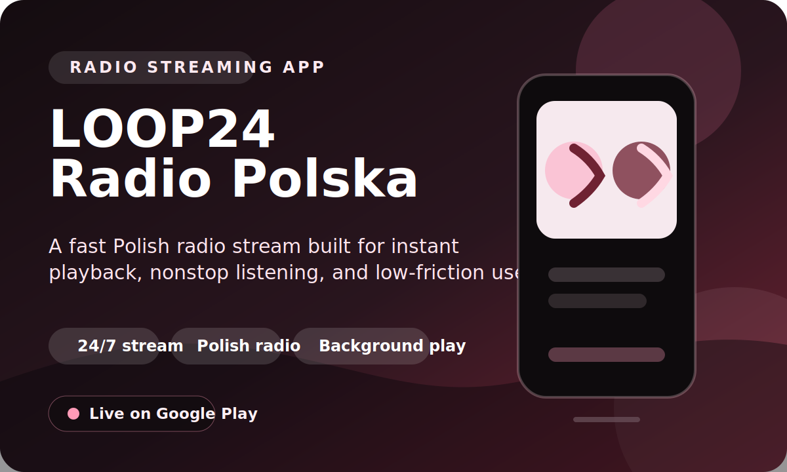
      </a>
      
RADIO STREAMING APP

      <h3 align="center">LOOP24 Radio Polska</h3>
      

        Nonstop Polish radio streaming app with fast playback, background listening, and a simple tap-to-play experience.
      

      
<code>24/7 Stream</code> <code>Background Audio</code> <code>Polish Market</code>

      
<strong>Launch:</strong> Live on Google Play

      

        <a href="https://play.google.com/store/apps/details?id=com.app.loop_radio">Android</a>
      

    </td>
    <td width="50%" valign="top">
      <a href="https://play.google.com/store/apps/details?id=com.app.ai.habit_tracker_ai">
        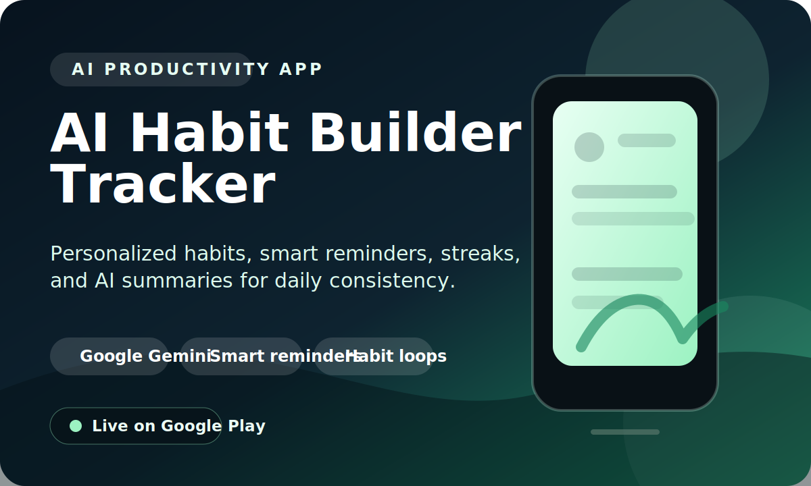
      </a>
      
AI PRODUCTIVITY APP

      <h3 align="center">AI Habit Builder Tracker</h3>
      

        AI-powered habit tracker with personalized plans, reminders, streaks, and progress insights for productivity and wellness goals.
      

      
<code>Google Gemini</code> <code>Smart Reminders</code> <code>Habit Loops</code>

      
<strong>Launch:</strong> Live on Google Play

      

        <a href="https://play.google.com/store/apps/details?id=com.app.ai.habit_tracker_ai">Android</a>
      

    </td>
  </tr>
  <tr>
    <td width="50%" valign="top">
      <a href="https://play.google.com/store/apps/details?id=com.app.tripPLNR">
        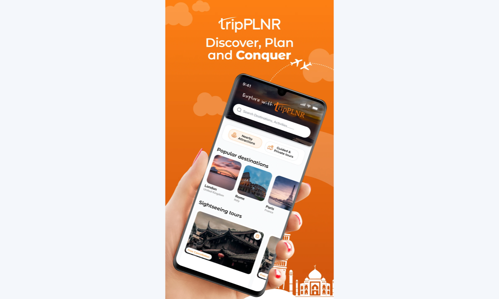
      </a>
      
TRAVEL PRODUCT

      <h3 align="center">TripPlanner</h3>
      

        Travel planning app that helps users search, compare, and book tickets, tours, and activities across 2500+ destinations.
      

      
<code>Flutter</code> <code>Firebase</code> <code>Node.js</code> <code>AI/ML</code>

      
<strong>Outcome:</strong> 300%+ engagement lift

      

        <a href="https://play.google.com/store/apps/details?id=com.app.tripPLNR">Android</a> |
        <a href="https://apps.apple.com/us/app/tripplnr-com/id6470180069">iOS</a>
      

    </td>
    <td width="50%" valign="top">
      <a href="https://play.google.com/store/apps/details?id=com.app.gtechofficial&hl=en">
        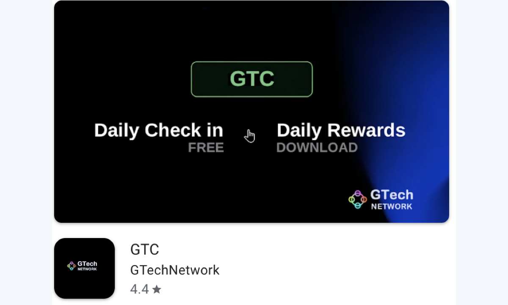
      </a>
      
CRYPTO REWARDS APP

      <h3 align="center">GTC Wallet</h3>
      

        Cryptocurrency wallet and rewards product built for network growth, task completion, social engagement, and community activation.
      

      
<code>Flutter</code> <code>BLoC</code> <code>Crypto</code> <code>Firebase</code>

      
<strong>Outcome:</strong> 60% ops reduction

      

        <a href="https://play.google.com/store/apps/details?id=com.app.gtechofficial&hl=en">Android</a>
      

    </td>
  </tr>
  <tr>
    <td width="50%" valign="top">
      <a href="https://apps.apple.com/us/app/land-cy/id6450110690">
        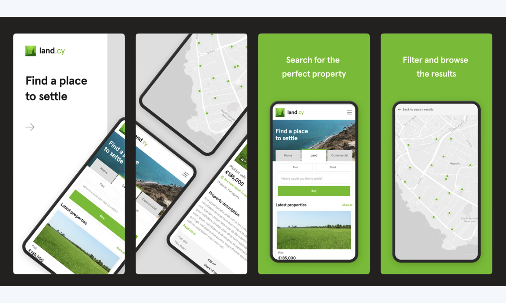
      </a>
      
REAL ESTATE PLATFORM

      <h3 align="center">Landcy</h3>
      

        Real estate platform for plots, fields, and other property listings with search, filtering, and alert-driven discovery.
      

      
<code>React</code> <code>Node.js</code> <code>MongoDB</code> <code>Firebase</code>

      
<strong>Outcome:</strong> 70% faster search

      

        <a href="https://apps.apple.com/us/app/land-cy/id6450110690">iOS</a>
      

    </td>
    <td width="50%" valign="top">
      <a href="https://play.google.com/store/apps/details?id=com.aldroid.voidspace_ai">
        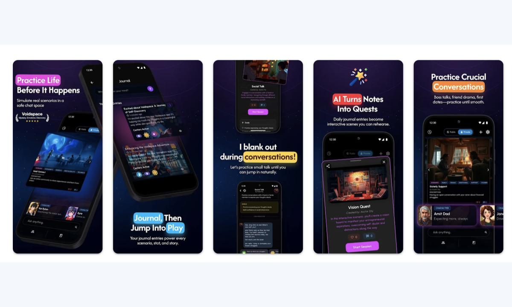
      </a>
      
RETENTION-LED APP

      <h3 align="center">VoidSpace</h3>
      

        Gamified life and showcase platform built around retention, personalized user flows, and strong product-led engagement loops.
      

      
<code>Flutter</code> <code>Node.js</code> <code>MongoDB</code> <code>AWS</code>

      
<strong>Outcome:</strong> 250% retention boost

      

        <a href="https://play.google.com/store/apps/details?id=com.aldroid.voidspace_ai">Android</a>
      

    </td>
  </tr>
</table>

  
<strong>More recent launches</strong>

   

  <table>
    <tr>
      <td width="33%" valign="top">
        <a href="https://play.google.com/store/apps/details?id=com.salim.user">
          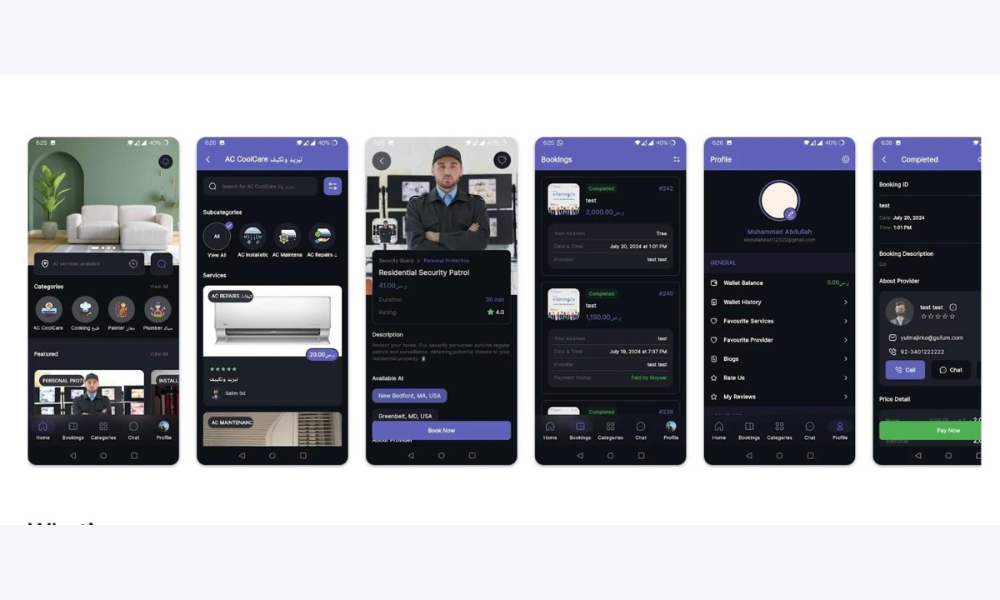
        </a>
        
FIELD SERVICES PLATFORM

        <h3 align="center">Salim Service</h3>
        
Booking platform for home maintenance and service operations.

        
<code>Flutter</code> <code>Operations</code> <code>Bookings</code>

        
<strong>Outcome:</strong> $1M+ first-year projection

        
<a href="https://play.google.com/store/apps/details?id=com.salim.user">Android</a>

      </td>
      <td width="33%" valign="top">
        <a href="https://apps.apple.com/us/app/%D9%85%D8%B3%D9%86%D8%A7%D9%81/id6471083459">
          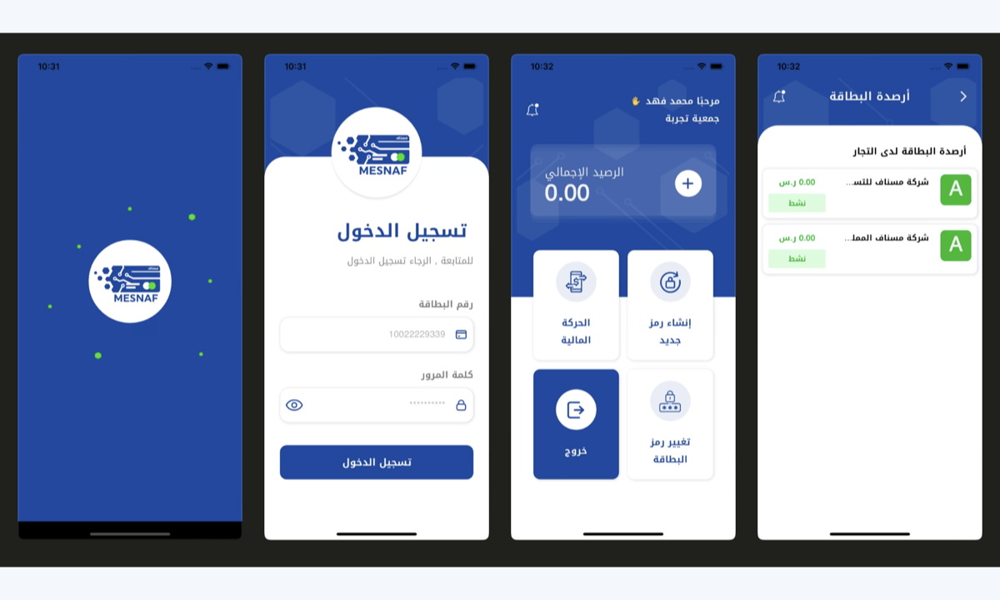
        </a>
        
FINTECH PRODUCT

        <h3 align="center">Mesnaf</h3>
        
Banking and finance product with AI-driven insight workflows.

        
<code>Finance</code> <code>AI Workflows</code> <code>iOS</code>

        
<strong>Outcome:</strong> 80% faster analysis

        
<a href="https://apps.apple.com/us/app/%D9%85%D8%B3%D9%86%D8%A7%D9%81/id6471083459">iOS</a>

      </td>
      <td width="33%" valign="top">
        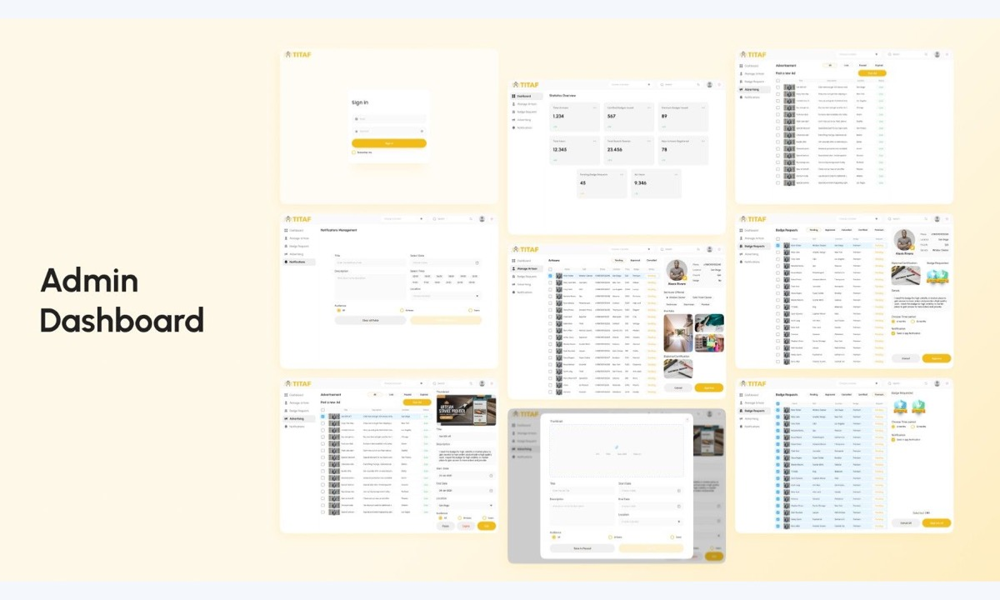
        
OPERATIONS DASHBOARD

        <h3 align="center">Titaf Admin</h3>
        
Ops dashboard for users, artisans, orders, payments, and support workflows.

        
<code>Admin</code> <code>Support</code> <code>Payments</code>

        
<strong>Outcome:</strong> 70% fewer support tickets

        
<a href="https://kodingklouds.com/">Studio Portfolio</a>

      </td>
    </tr>
  </table>

## Delivery Model

<table>
  <tr>
    <td width="33%" valign="top" align="center">
      <strong>Discovery</strong> 
      Scope, success metrics, budget alignment, and the right build path before writing throwaway code.
    </td>
    <td width="33%" valign="top" align="center">
      <strong>Design and build</strong> 
      PRD, Figma, engineering, weekly sprint demos, and tight iteration around the actual business goal.
    </td>
    <td width="33%" valign="top" align="center">
      <strong>Launch and grow</strong> 
      Store approvals, analytics, crash monitoring, QA, post-launch support, and the next roadmap step.
    </td>
  </tr>
</table>

- Requirements document can start within 12 hours.
- First working build can land in 7-14 days for MVP-focused projects.
- Milestone-based payments keep progress transparent.
- QA, analytics, and crash monitoring are part of delivery.
- Post-launch support is included for 30 days.

## Best Fit

  <code>Startups</code>
  <code>SaaS</code>
  <code>Marketplaces</code>
  <code>Booking platforms</code>
  <code>Fintech</code>
  <code>Real estate</code>
  <code>Travel products</code>
  <code>Internal tools</code>
  <code>Admin panels</code>
  <code>AI features</code>

## Stack

  

  Also used regularly: BLoC, Stripe, GraphQL/REST, App Store and Play Store deployment, CI/CD, SEO, schema, sitemaps, and product analytics.

## Contact

  If you need a strong MVP, a polished client-facing app, or a web platform that actually converts, send me the brief and I will reply with scope, timeline, and next steps.

  
  
  
  

